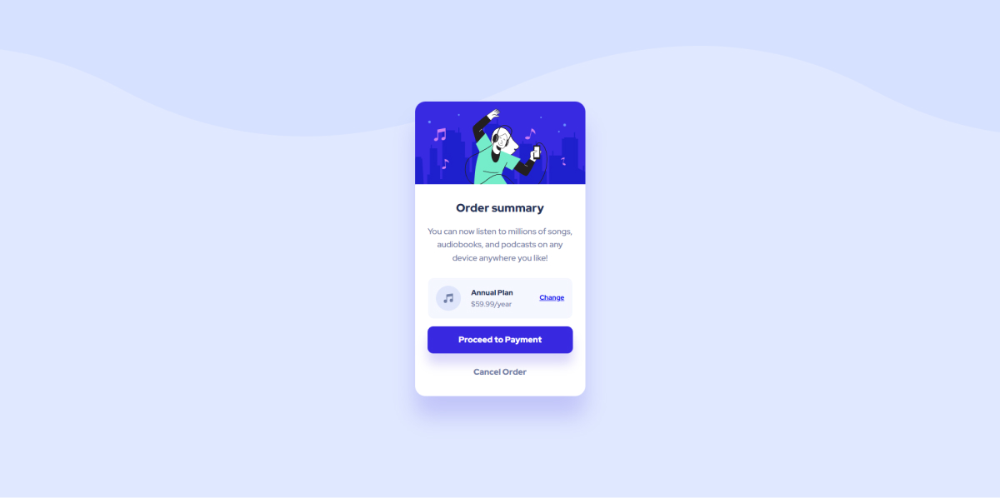

# Frontend Mentor - Order summary card solution

This is a solution to the [Order summary card challenge on Frontend Mentor](https://www.frontendmentor.io/challenges/
order-summary-component-QlPmajDUj). Frontend Mentor challenges help you improve your coding skills by building realistic projects.  

## Table of contents

- [Frontend Mentor - Order summary card solution](#frontend-mentor---order-summary-card-solution)
  - [Table of contents](#table-of-contents)
  - [Overview](#overview)
    - [The challenge](#the-challenge)
    - [Screenshot](#screenshot)
    - [Links](#links)
  - [My process](#my-process)
    - [Built with](#built-with)
    - [What I learned](#what-i-learned)
    - [Continued development](#continued-development)
  - [Author](#author)
  - [Acknowledgments](#acknowledgments)

## Overview

### The challenge

Users should be able to:

- View the optimal layout depending on their device's screen size
- See hover states for interactive elements

### Screenshot



### Links

- Solution URL: [https://github.com/KrzysztofGrudzien/frontend-mentor-order-summary-component](https://github.com/KrzysztofGrudzien/frontend-mentor-order-summary-component)
- Live Site URL: [https://krzysztofgrudzien.github.io/frontend-mentor-order-summary-component/](https://krzysztofgrudzien.github.io/frontend-mentor-order-summary-component/)

## My process

### Built with

- Semantic HTML5 markup
- CSS custom properties
- Flexbox
- Mobile-first workflow
- BEM Methodology

### What I learned

In this project, I tried to repeat my knowledge about pure HTML and CSS. As an additional tip, I used CSS properties and BEM Methodology.

Few lines of code from the project:

```html
    <div class="body-bg"></div>
<main class="main">
    <div class="card">
        <div class="card__img-wrapper">
            
        </div>
        <h1 class="card__title">Order summary</h1>
        <p class="card__description">
            You can now listen to millions of songs, audiobooks, and podcasts on any device anywhere you like!
        </p>
        <div class="order">
            
            <div class="order__plan">
                <span class="text-bold">Annual Plan</span>
                $59.99/year
            </div>
            <a href="#" class="order__link">Change</a>
        </div>
        <div class="card__links">
            <a href="#" class="card__link card__link--order">Proceed to Payment</a>
            <a href="#" class="card__link card__link--cancel">Cancel Order</a>
        </div>
    </div>
</main>
```
```css
.card__title {
    color: var(--color-text-dark);
    font-size: 2.2rem;
    font-weight: 900;
    padding: 3.2rem 0 2rem 0;
    text-align: center;
}

@media screen and (min-width: 376px) and (max-width: 1440px) {
    .card__title {
        font-size: 2.8rem;
    }
}

.card__description {
    color: var(--color-text);
    line-height: 1.6;
    padding: 0 2.2rem;
    text-align: center;
}

.card__links {
    display: flex;
    flex-direction: column;
    margin: 0 2.4rem;
    margin-top: -1rem;
}
```

### Continued development

## Author

- Website - [In progress]
- Frontend Mentor - [@KrzysztofGrudzien](https://www.frontendmentor.io/profile/KrzysztofGrudzien)
- E-mail - krzysztof.grudzien.fed@gmail.com

## Acknowledgments
